# Twitter Sentiments Analysis Application

## Introduction

This is a console application that consumes the [Twitter API](https://dev.twitter.com/) to get tweets from
a user and then make sentiments analysis on the tweets using [Alchemy API](http://www.alchemyapi.com/). The
twitter api uses OAuth to validate the api and in this project I did not consume the twitter api directly but
used a python module called [Tweepy](https://github.com/tweepy/tweepy).

## Getting Started

This application due to [tweepy](https://github.com/tweepy/tweepy), requires `python 3.4` or lower but preferrably
`python 3.4` which you can download from their official [page](https://python.org/downloads/).

Together with the documentation of the application I have included a [requirements.txt](requirements.txt) file
which has a list of the modules that the application depends on to run. To install the dependencies listed, run
the following code: `pip install -r requirements.txt`.

I did all my development from a virtual environment and this [documentation](http://docs.python-guide.org/en/latest/dev/virtualenvs/)
gives a detailed methodology to create and use a virtual environment.

To clone my repository, run the following command on your terminal:

   `git clone https://github.com/andela-gathondu/bc-14-twitter.git`

## Prerequisites

All the required modules are in the [requirements.txt](requirements.txt) so make sure you have installed them. 

## Running the twitter sentiments analysis application

1. Go to the directory where you have the project cloned and open a terminal from there. For windows it's 
   `SHIFT KEY + RIGHT CLICK` and choose open command line and unix based systems just right click and open
   terminal.

2. In the terminal type and run the following command, `python Tweet_Anaysis.py`. Any version of python lower
   than python 3.4 works perfectly. The following screen will display:

      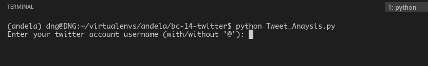

3. The application recorgnizes a username with or without @ symbol so both `@idiocrate_` and `idiocrate_`
   are correct values. Press enter and the app asks you to input the number of tweets to view which at the moment
   the maximum tweets you can view are 10. After this it will ask you if you would like to include retweets. By
   default retweets are included but typing `n` or `no` skips the retweets.

      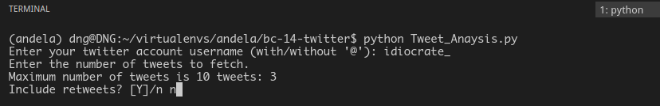
      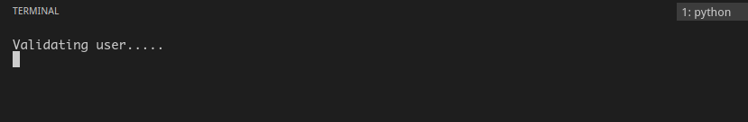

   A progress bar is then displayed that shows the progress of the application as it fetches the tweets.

      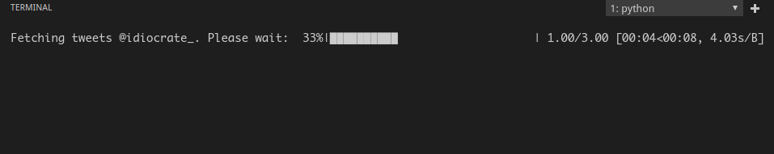

4. If the username is valid, a welcome message and the view options are displayed:

      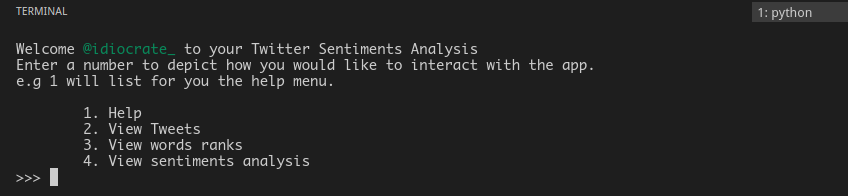

   Otherwise the user is notified.

      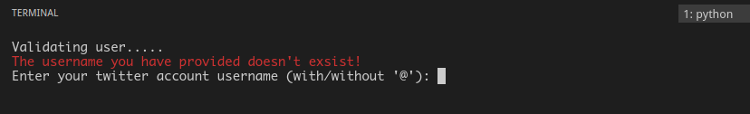

5. The help function assists the user on how to go about using the application interface.
   `Type 1` to view:

      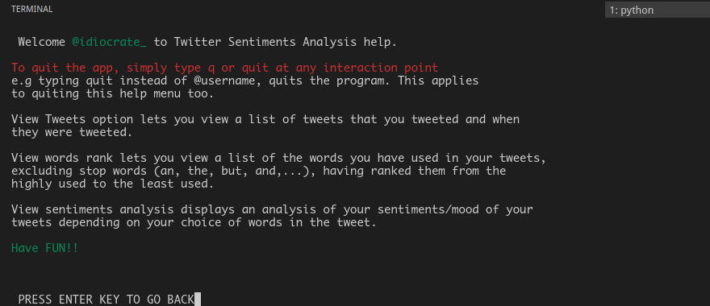

6. `Type 2` to view the tweets. Depending on the number of tweets you requested you can also state the
    number of tweets to display.

      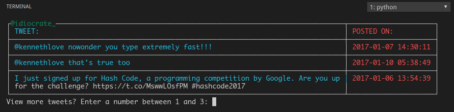

7. `Type 3` to view the words frequency.

      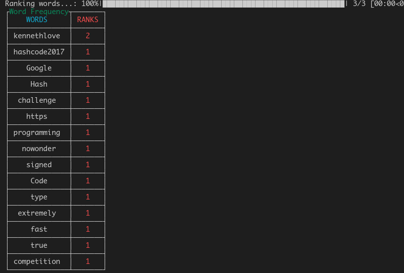

8. `Type 4` to view the sentiment analysis on your tweets.

      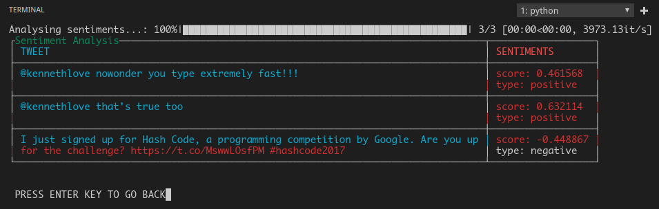

9. At any interaction point the user can type `q` or `quit` to exit the application.

      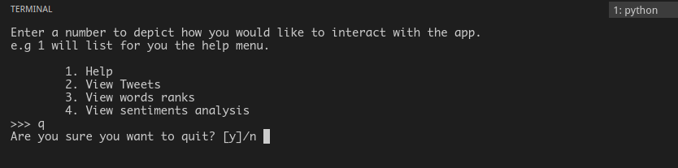
      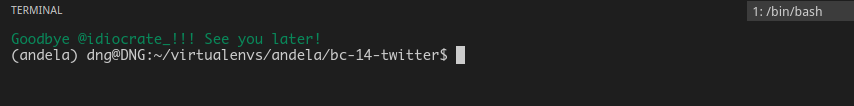

## Built With

   * [Visual Studio Code](https://code.visualstudio.com/) for debian
   * [Python 3.4.2](https://python.org/downloads/)

## Resources

   * [Alchemy Api documentation.](https://www.ibm.com/watson/developercloud/alchemy-language/api/v1/#introduction)
   * [Andelans](https://andela.com/), top 1%.
   * [tweepy.](https://github.com/tweepy/tweepy)
   * [Stack Overflow](https://stackoverflow.com/)
   * [terminaltables.](https://robpol86.github.io/terminaltables/)
   * [tqdm.](https://github.com/tqdm/tqdm)
   * [nltk](http://www.nltk.org/index.html)